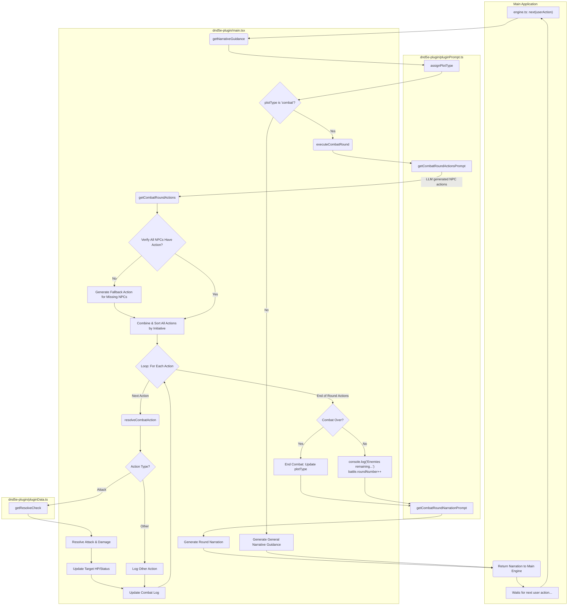

```mermaid
graph TD
    subgraph Main Application
        A["engine.ts: next(userAction)"]
        V(Return Narration to Main Engine)
        W[Waits for next user action...]
    end

    subgraph dnd5e-plugin/main.tsx
        B(getNarrativeGuidance)
        C{plotType is 'combat'?}
        E(executeCombatRound)
        G{Verify All NPCs Have Action?}
        F(getCombatRoundActions)
        H[Generate Fallback Action for Missing NPCs]
        I[Combine & Sort All Actions by Initiative]
        J{Loop: For Each Action}
        K(resolveCombatAction)
        L{Action Type?}
        M[Resolve Attack & Damage]
        N[Update Target HP/Status]
        O[Log Other Action]
        P[Update Combat Log]
        Q{Combat Over?}
        R[End Combat: Update plotType]
        T["console.log('Enemies remaining...')<br/>battle.roundNumber++"]
        S[Generate Round Narration]
        D[Generate General Narrative Guidance]
    end

    subgraph dnd5e-plugin/pluginPrompt.ts
        C_prompt[assignPlotType]
        F_prompt[getCombatRoundActionsPrompt]
        S_prompt[getCombatRoundNarrationPrompt]
    end
    
    subgraph dnd5e-plugin/pluginData.ts
        M_data[getResolveCheck]
    end

    A --> B;
    B --> C_prompt;
    C_prompt --> C;
    C -- No --> D;
    C -- Yes --> E;
    E --> F_prompt;
    F_prompt -- LLM generated NPC actions --> F;
    F --> G;
    G -- No --> H;
    H --> I;
    G -- Yes --> I;
    I --> J;
    J -- Next Action --> K;
    K --> L;
    L -- Attack --> M_data;
    M_data --> M;
    L -- Other --> O;
    M --> N;
    N --> P;
    O --> P;
    P --> J;
    J -- End of Round Actions --> Q;
    Q -- Yes --> R;
    Q -- No --> T;
    R --> S_prompt;
    T --> S_prompt;
    S_prompt --> S;
    S --> V;
    D --> V;
    V --> W;
    W --> A;
```